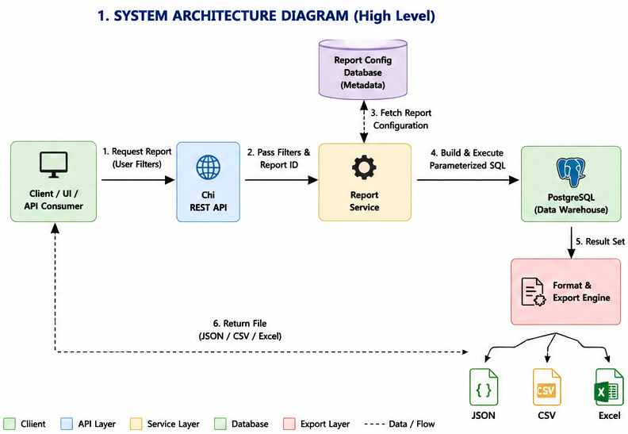
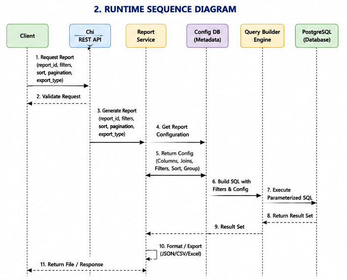
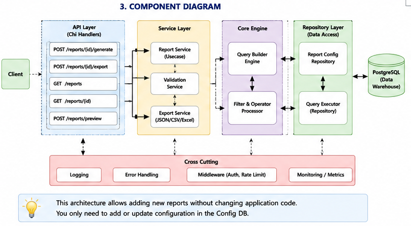

# Reporting/MIS Service

A generic, **configuration-driven** reporting engine built with Go, Chi, and
PostgreSQL. New reports are added by inserting rows into the report
configuration tables — no application code changes required.

---

## 1. High-Level Design

### 1.1 System Architecture



### 1.2 Runtime Sequence



### 1.3 Component Diagram



### 1.4 Clean Architecture Layering

```
Handler (HTTP/DTO)  →  Usecase (orchestration)  →  Domain (entities, ports)
                                   │                       ▲
                                   ▼                       │
                         Querybuilder / Exporter    Repository (Postgres)
```

* **domain** — entities (`ReportTemplate`, `ReportColumn`, ...) and the
  interfaces (`ports`) that outer layers implement/consume. Has zero
  external dependencies.
* **usecase** — orchestrates: load config → build query → execute →
  format/export. Depends only on domain interfaces, never on pgx/chi directly.
* **repository** — Postgres implementation of the domain repository ports
  (pgx-based).
* **querybuilder** — turns a `ReportTemplate` + runtime `ReportRequest`
  into a parameterized SQL string + args. Pure, no I/O, fully unit-testable.
* **exporter** — turns a result set into CSV/Excel/JSON.
* **handler** — Chi routes, request decoding/validation, response encoding.
* **middleware** — request ID, structured request logging, panic recovery.

### 1.5 Database Flow

```
report_templates ──┬─< report_columns
                    ├─< report_joins
                    ├─< report_filters   (whitelist of filterable fields)
                    ├─< report_sorts     (whitelist of sortable fields)
                    ├─< report_groups
                    └─< report_exports
```

The config tables are the **only** source of table/column identifiers the
query builder is allowed to use. A runtime request can only reference a
`field` that already exists in `report_columns`/`report_filters`/`report_sorts`
for that report — arbitrary user-supplied identifiers are never interpolated
into SQL (see [§5 Security](#5-security)).

---

## 2. Database Schema

> Design notes vs. the original sketch:
> * `order` is a reserved word in Postgres → renamed to `display_order`.
> * Every table/column reference is qualified with a **table alias**
>   (`table_alias`) so the same physical table can be joined more than once
>   (e.g. `manager` and `employee` both pointing at `users`).
> * `report_filters` / `report_sorts` / `report_groups` are **whitelists** —
>   they declare what a caller is *allowed* to filter/sort/group by at
>   runtime, not the runtime request itself (that comes from the API body).
> * `operators` on `report_filters` is an array so one field can support
>   several operators (e.g. `status` supports `=` and `in`).

```sql
CREATE TABLE report_templates (
    id            BIGSERIAL PRIMARY KEY,
    name          TEXT NOT NULL UNIQUE,
    description   TEXT,
    base_table    TEXT NOT NULL,
    base_alias    TEXT NOT NULL DEFAULT 't0',
    enabled       BOOLEAN NOT NULL DEFAULT TRUE,
    max_page_size INT NOT NULL DEFAULT 200,
    created_at    TIMESTAMPTZ NOT NULL DEFAULT now(),
    updated_at    TIMESTAMPTZ NOT NULL DEFAULT now()
);

CREATE TABLE report_columns (
    id            BIGSERIAL PRIMARY KEY,
    report_id     BIGINT NOT NULL REFERENCES report_templates(id) ON DELETE CASCADE,
    table_alias   TEXT NOT NULL,
    column_name   TEXT NOT NULL,
    alias         TEXT NOT NULL,
    expression    TEXT,               -- optional raw expr, e.g. SUM(t1.amount)
    data_type     TEXT NOT NULL DEFAULT 'string',
    is_visible    BOOLEAN NOT NULL DEFAULT TRUE,
    display_order INT NOT NULL DEFAULT 0,
    UNIQUE (report_id, alias)
);

CREATE TABLE report_joins (
    id            BIGSERIAL PRIMARY KEY,
    report_id     BIGINT NOT NULL REFERENCES report_templates(id) ON DELETE CASCADE,
    join_type     TEXT NOT NULL DEFAULT 'LEFT'
                    CHECK (join_type IN ('INNER','LEFT','RIGHT','FULL')),
    table_name    TEXT NOT NULL,
    table_alias   TEXT NOT NULL,
    left_alias    TEXT NOT NULL,
    left_column   TEXT NOT NULL,
    right_alias   TEXT NOT NULL,
    right_column  TEXT NOT NULL,
    join_order    INT NOT NULL DEFAULT 0
);

CREATE TABLE report_filters (
    id            BIGSERIAL PRIMARY KEY,
    report_id     BIGINT NOT NULL REFERENCES report_templates(id) ON DELETE CASCADE,
    field_name    TEXT NOT NULL,       -- public name used in API requests
    table_alias   TEXT NOT NULL,
    column_name   TEXT NOT NULL,
    data_type     TEXT NOT NULL DEFAULT 'string',
    operators     TEXT[] NOT NULL DEFAULT ARRAY['=']::TEXT[],
    required      BOOLEAN NOT NULL DEFAULT FALSE,
    UNIQUE (report_id, field_name)
);

CREATE TABLE report_sorts (
    id            BIGSERIAL PRIMARY KEY,
    report_id     BIGINT NOT NULL REFERENCES report_templates(id) ON DELETE CASCADE,
    field_name    TEXT NOT NULL,
    table_alias   TEXT NOT NULL,
    column_name   TEXT NOT NULL,
    default_dir   TEXT NOT NULL DEFAULT 'asc' CHECK (default_dir IN ('asc','desc')),
    priority      INT NOT NULL DEFAULT 0,
    UNIQUE (report_id, field_name)
);

CREATE TABLE report_groups (
    id            BIGSERIAL PRIMARY KEY,
    report_id     BIGINT NOT NULL REFERENCES report_templates(id) ON DELETE CASCADE,
    table_alias   TEXT NOT NULL,
    column_name   TEXT NOT NULL,
    display_order INT NOT NULL DEFAULT 0
);

CREATE TABLE report_exports (
    id            BIGSERIAL PRIMARY KEY,
    report_id     BIGINT NOT NULL REFERENCES report_templates(id) ON DELETE CASCADE UNIQUE,
    allow_csv     BOOLEAN NOT NULL DEFAULT TRUE,
    allow_excel   BOOLEAN NOT NULL DEFAULT TRUE,
    allow_json    BOOLEAN NOT NULL DEFAULT TRUE,
    max_rows      INT NOT NULL DEFAULT 50000
);
```

Full migration files live in [`migrations/`](migrations).

---

## 3. API Design

| Method | Path                     | Purpose                                            |
|--------|---------------------------|-----------------------------------------------------|
| GET    | `/api/v1/reports`         | List enabled report templates                       |
| GET    | `/api/v1/reports/{id}`    | Get one template's metadata (columns, filters, ...)  |
| POST   | `/api/v1/reports/{id}/preview` | Run the report with a low, forced page size for quick iteration |
| POST   | `/api/v1/reports/{id}/generate`| Run the report and return JSON (paginated)      |
| POST   | `/api/v1/reports/{id}/export`  | Run the report and stream CSV/XLSX               |
| GET    | `/healthz`                | Liveness probe                                       |

Request body (`generate` / `preview` / `export`):

```json
{
  "filters": [
    { "field": "status", "operator": "=", "value": "Active" },
    { "field": "created_at", "operator": "between", "value": ["2026-01-01", "2026-06-30"] }
  ],
  "sort": [ { "field": "created_at", "direction": "desc" } ],
  "page": 1,
  "limit": 50,
  "format": "csv"
}
```

`format` is only read by `/export` (`csv` | `xlsx`); `generate`/`preview`
always return JSON.

Response (`generate`):

```json
{
  "report_id": 1,
  "columns": ["id", "name", "department"],
  "rows": [ { "id": 1, "name": "Asha", "department": "Engineering" } ],
  "page": 1,
  "limit": 50,
  "total_rows": 134,
  "execution_time_ms": 12
}
```

Errors use a single envelope (`{"error": {"code": "...", "message": "..."}}`)
with HTTP status mapped from the domain error kind (validation → 400,
not found → 404, unknown → 500).

---

## 4. Runtime Execution Flow

1. Chi decodes/validates the request body (structural validation only —
   field names, operators, and types are *semantically* validated against
   the report's config in step 3-4).
2. `usecase.ReportService` loads the `ReportTemplate` (+ columns, joins,
   filters, sorts, groups, export settings) from the repository, by ID.
3. `querybuilder.Validator` checks every requested filter/sort field exists
   in the template's whitelist and that the operator is allowed for that
   field's data type.
4. `querybuilder.Builder` assembles `SELECT ... FROM ... JOIN ... WHERE ...
   GROUP BY ... ORDER BY ... LIMIT/OFFSET` with `$1, $2, ...` placeholders,
   returning `(sql string, args []any)`.
5. The repository executes the parameterized query via `pgx`.
6. Rows are scanned into `[]map[string]any` (column set is dynamic per
   report) preserving the configured column order.
7. For `generate`/`preview`: JSON is returned directly.
   For `export`: the exporter streams CSV or XLSX to the response with the
   right `Content-Type`/`Content-Disposition`.

---

## 5. Security

* **Identifiers** (table/column names) are *never* taken from the HTTP
  request. The builder only ever emits identifiers that were read from the
  `report_*` config tables, which are trusted, operator-managed data. A
  request's `field` value is used purely as a **lookup key** into that
  config; if it doesn't match a whitelisted entry, the request is rejected
  with 400 before any SQL is built.
* **Values** are always passed as query parameters (`$1, $2, ...`) — never
  string-concatenated — via `pgx`'s native parameter binding.
* **Operators** map to a fixed, hardcoded set of SQL fragments
  (`=`, `!=`, `>`, `<`, `>=`, `<=`, `like`, `in`, `between`, ...). A request
  can only select one of these by name; no raw operator text ever reaches
  the SQL string.
* **Pagination** `limit`/`offset` are validated as bounded integers
  (`limit` capped by `report_templates.max_page_size`) before being bound
  as parameters.
* Table/column names from config are additionally passed through an
  identifier sanitizer (`^[A-Za-z_][A-Za-z0-9_]*$`) as defense-in-depth in
  case config data is ever hand-edited.

---

## 6. Export Mechanism

```
Query Result (rows []map[string]any, ordered columns []Column)
      │
      ├── JSON   → encoding/json straight to the HTTP response
      ├── CSV    → encoding/csv, streamed row-by-row (no full buffering)
      └── XLSX   → excelize, one sheet, header row + data rows
```

`report_exports` gates which formats are enabled per report and caps
`max_rows` to keep exports bounded; requests beyond the cap get a 400
telling the caller to add filters.

---

## 7. Error Handling & Logging

* Structured logging via `log/slog` (JSON handler in production).
* `middleware.RequestID` assigns/propagates an ID; `middleware.Logger` logs
  one line per request: request ID, method, path, status, duration.
* The usecase layer logs one line per report execution: report ID,
  generated SQL **with placeholders** (never bound values), row count,
  execution time, and error (if any) — so no filter *values* ever hit logs.
* Domain errors are typed (`ErrValidation`, `ErrNotFound`, `ErrInternal`)
  and mapped to HTTP status codes at the handler boundary; unexpected
  panics are recovered by middleware and returned as 500 with the request
  ID for correlation.

---

## 8. Clean Architecture Folder Structure

```
cmd/
  server/            # main.go — wiring only
internal/
  domain/            # entities + repository/exporter ports (no deps)
  usecase/           # ReportService: load → build → execute → format
  querybuilder/       # Builder, Validator, operator table
  repository/postgres/# pgx implementation of domain ports
  exporter/           # csv.go, excel.go, json.go
  handler/            # chi routes, DTOs, request/response mapping
  middleware/          # request id, logging, recover
pkg/
  logger/             # slog setup
  database/           # pgxpool setup
  response/            # JSON error/response helpers
configs/               # config struct + env loading
migrations/             # SQL migrations (golang-migrate compatible)
docs/                    # diagrams
```

Unit tests are colocated as `_test.go` next to the code they cover (idiomatic
Go, and what `go test ./...` / coverage tooling expects); a small
`tests/integration` suite (behind a build tag, needs a real Postgres)
exercises the full stack end-to-end.

---

## 9. Testing Strategy

| Layer         | Approach                                                        |
|---------------|-------------------------------------------------------------------|
| querybuilder  | Table-driven tests asserting exact SQL + args for each filter/operator/join/sort/pagination combo |
| validator     | Reject unknown field, disallowed operator, wrong value type/shape |
| usecase       | Mock repository + mock exporter, assert orchestration & error mapping |
| repository    | `pgxmock` — assert generated queries are issued correctly |
| handler       | `httptest` — status codes, body shape, validation errors |
| exporter      | CSV/XLSX byte-level assertions on small fixtures |

Target: 80%+ coverage on `querybuilder`, `usecase`, `handler`, `exporter`.

---

## 10. Tech Stack

- Go 1.24, Chi v5
- PostgreSQL, `jackc/pgx/v5`
- `qax-os/excelize` (XLSX), `encoding/csv` (CSV)
- `log/slog` (structured logging)
- `testify`, `pashagolub/pgxmock`

---

## Running Locally

```bash
docker compose up -d db
make migrate-up
make run
```

See [`Makefile`](Makefile) and [`configs/`](configs) for env vars.
